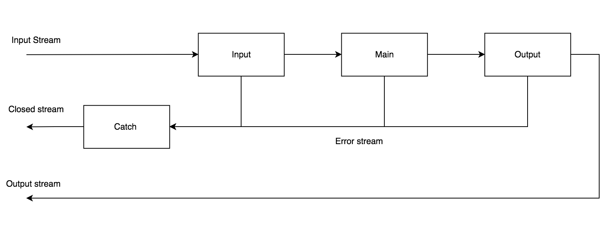

# Pipeline

Functional and in a way reactive programming used to process data!

For API visit [docs](./docs).

## The idea

Application "architect" should be the only one to combine (couple) services (functions) into meaningful system (the application).

Services shouldn't know about each other. Consider services (pipes), like tools you use to build an application.

Pipeline gives you the mechanism to combine services and create flows which all together create an application.

## Basic concepts

Pipes are used to build pipelines. Pipes are placed in pipeline sections. The section represents order of execution.



Pipeline has 3 core sections: input => main => output

* **input** - First in order of execution, used to filter unwanted streams or to supply stream with additional data
* **main** - Second in order of execution, the core of any pipeline, used to process stream, do what ever it has to do (side effect, calculation...)
* **output** - Third and last in order of execution, used to check results of stream processing

Additional **catch** section is used to process closing (error) stream. Catch pipes output will be actual error stream. Consider catch as a special case section.

A section can have multiple pipes but must be mutually independent. Independent pipes doesn't modify the same stream property!

Pipes execution:

* Pipes in the same section are executed in parallel.
* Sections are executed serially, one after the other. Only when all pipes in one sections are resolved stream is passed to the next section.

Work on the stream by mutating it. Stream may be mutated because:

* Pipes in the same section must be independent, they shouldn't modify on the same stream property.
* Pipes may not persist the stream (are stateless) meaning different sections are independent.

Async and sync functions are standardised, functions may return value or promise. Flow will always respect pipe execution rules. 
Passing the stream down the flow:

* Returning the `undefined` will pass the current stream. 
* Promises are integrated in the Pipeline. Returning `thenable` will wait for it to complete and pass the stream based on the resolved value. Same rules apply to the resolved value as to the non promise values.  
* Returning other values will pass that value as the new stream.

Pseudo example
```javascript
// Service example
const updateUserService =
  new Pipeline()

    // Input section
    // All pipes are executed in parallel
    // If any pipe closes (throws) other core sections are skipped
    // Error stream is passed to catch pipes
    .input(userExists)
    .input(validateUserData)
    .input(getUser)

    // Main section
    // All is good, update user
    .main(updateUser)

    // Output section
    // User is updated, format the response
    .output(formatSuccessResponse)

    // Catch Section
    // Catchs any error and format the error response
    .catch(formatErrorResponse)

// Called when request recieved
updateUserService
  .pipe(userUpdateData)
    .then(sendResponse)
    .catch(sendResponse);

```

## Why Pipeline

Creating web services didn't feel quite right for my taste. I simply wanted to use functions to describe a service without need to jump around the code. 

There wasn't such a framework which standardised the data flow and allowed me to use functions alone to build one in a simple way. It was hard to describe flow, a lot of effort was needed to take care of async and sync execution and data passed between.

It's still pretty much work in progress and it's getting hard for me to objectively look at the idea so I really appreciate feedback. 

## Roadmap

* Get feedback
* Tests, tests, tests :scream;
* Add missing examples
* Document advanced concepts
* Clean up code (document)
* Separate concept from JS implementation
* Where can it lead to?
